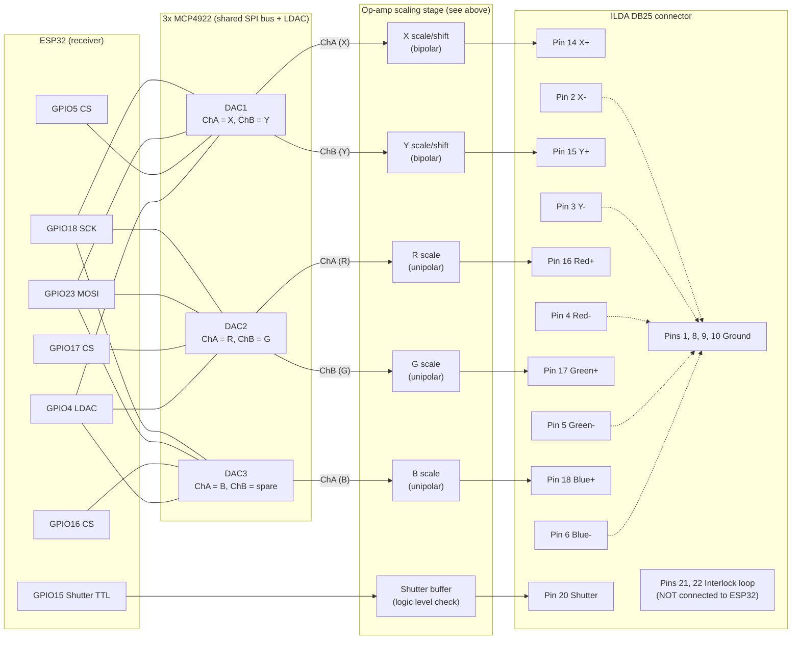

# Hardware reference design

This describes the analog front end the receiver firmware
(`firmware/receiver`) targets. It's a starting point in the style of common
DIY/open-hardware ILDA interfaces (SPI DAC + op-amp scaling stage), not a
verified, ready-to-build schematic. **Bench-test the output voltages with a
multimeter/oscilloscope before connecting to the projector** - see
`docs/SAFETY.md`.

## Why an external DAC

The ESP32's built-in DAC is 8-bit, 2 channels, 0-3.3V - too low resolution
and too few channels for X/Y/R/G/B (5 channels) at a voltage range anything
like what an ILDA input expects. This design uses external SPI DACs instead:
faster and higher resolution than an I2C DAC (like the MCP4728), which
matters because point rate is bottlenecked by how fast you can update the
DACs and have all channels latch together.

## Bill of materials (per receiver node)

| Qty | Part | Purpose |
|-----|------|---------|
| 3 | Microchip **MCP4922** (dual 12-bit SPI DAC, DIP-14 or SOIC-14) | X/Y, R/G, B (+1 spare channel) |
| 1 | Precision voltage reference, e.g. **MCP1525** (2.5V) or similar, per MCP4922's VREFA/VREFB inputs | Sets DAC full-scale output; using a clean reference instead of VDD keeps output level consistent regardless of USB/regulator noise |
| 1 | Quad op-amp, e.g. **TL074** (or similar rail-to-rail capable part) per DAC bank as needed | Level-shifts/scales each 0-VREF unipolar DAC output to the bipolar (or wider unipolar) swing your projector's ILDA input expects |
| 1 | ESP32 dev board (WROOM/WROVER, any common DevKitC-style board) | Runs the receiver firmware |
| - | Resistors/caps for the op-amp scaling stage (values depend on your target voltage range - see below) | |

The sender node just needs a second bare ESP32 dev board - no additional
hardware.

## Digital wiring (ESP32 to DACs)

All three MCP4922s share one SPI bus (SCK, MOSI) with independent chip-select
lines, and share a single LDAC line so every channel updates simultaneously:

| Signal | ESP32 pin (default, see `config.h`) | MCP4922 pin |
|--------|--------------------------------------|-------------|
| SCK    | GPIO18 | SCK on all 3 DACs |
| MOSI (SDI) | GPIO23 | SDI on all 3 DACs |
| CS - DAC1 (X/Y) | GPIO5  | CS |
| CS - DAC2 (R/G) | GPIO17 | CS |
| CS - DAC3 (B/spare) | GPIO16 | CS |
| LDAC   | GPIO4 | LDAC on **all 3 DACs, tied together** |
| Shutter TTL out | GPIO15 | (feeds the front end's shutter buffer, not a DAC) |

Why a shared LDAC matters: the firmware writes each DAC's input register
over SPI one at a time (that's how SPI works - one bus, one transaction at a
time), but holds each write in the DAC's internal latch rather than applying
it to the output immediately (`BUF=1` in the command word keeps it
latched). Once all 5 channels have been shifted in, the firmware pulses
LDAC low once, and all three chips update their analog outputs on the same
edge. Without this, X could move slightly before Y, or color could lag
position, causing visible smearing/misregistration - especially at higher
point rates.

## MCP4922 command word

Each 16-bit SPI write is: `A/B | BUF | GA | SHDN | D11..D0`. This project
uses `BUF=1` (buffered, required for the shared-LDAC latching behavior
above) and `GA=1` (1x gain, i.e. output range is `0..VREF`). See the
MCP4922 datasheet for the full command format if you need to change this.

## Analog scaling stage (DAC output -> ILDA signal levels)

With `GA=1` and a 2.5V reference, each DAC channel outputs `0V..~2.5V`
across its 12-bit range, centered logically at mid-scale (code 2048) for
X/Y. The op-amp stage needs to:

1. **X/Y**: shift and scale the `0..2.5V` unipolar signal (center at
   ~1.25V) into a bipolar swing centered at 0V, sized for whatever your
   projector's galvo inputs expect (commonly on the order of ±5V, but
   *confirm this for the DS-1000RGB before building the final gain stage* -
   driving an input harder than it's designed for can damage it, and
   driving it too softly just gives you a small, off-center image). A
   standard op-amp difference/summing-amplifier stage referenced to a
   mid-scale voltage does this; the exact resistor values depend on the
   voltage range you confirm.
2. **R/G/B**: typically only need scaling to `0V..Vmax` (unipolar, no
   bipolar shift needed) since color/intensity inputs are usually simple
   0V-off to Vmax-full ranges rather than bipolar. Confirm your projector's
   expected max before setting the gain.

Because the exact target voltage range depends on your specific projector
and how conservative you want to be, this repo intentionally does not
prescribe fixed resistor values - build the scaling stage as a simple,
adjustable (e.g. trimmer-pot gain) op-amp stage first, verify the output
range on a bench meter/scope with nothing else connected, and only then
wire it to the projector.

## Full connection diagram: receiver to DB25 ILDA connector

This ties together the ESP32 GPIO table above, the DAC banks, the op-amp
scaling stage, and the DB25 pins from `docs/ILDA_INTERFACE.md`. It assumes
the single-ended front end noted there (drive each `+` pin, tie the matching
`-` pin to signal ground) - confirm that assumption holds for your DS-1000RGB
before wiring.

Ground rule for the dotted lines above: `X-`/`Y-`/`R-`/`G-`/`B-` tie to
signal ground (same ground as `PGND`/pins 1, 8, 9, 10), not to the ESP32's
own logic ground directly - route everything through a single star ground
point at the front end to avoid ground-loop noise on the analog lines.

| From | Through | To (DB25 pin) |
|------|---------|----------------|
| DAC1 channel A (X, from ESP32 GPIO5 CS + shared SCK/MOSI/LDAC) | X op-amp scaling stage | Pin 14 (X+) |
| DAC1 channel B (Y) | Y op-amp scaling stage | Pin 15 (Y+) |
| DAC2 channel A (R, from ESP32 GPIO17 CS) | R op-amp scaling stage | Pin 16 (Red+) |
| DAC2 channel B (G) | G op-amp scaling stage | Pin 17 (Green+) |
| DAC3 channel A (B, from ESP32 GPIO16 CS) | B op-amp scaling stage | Pin 18 (Blue+) |
| DAC3 channel B | spare - leave unconnected | - |
| ESP32 GPIO15 (shutter TTL) | shutter buffer stage | Pin 20 (Shutter) |
| Signal ground | star ground at the front end | Pins 1, 8, 9, 10, and the `X-`/`Y-`/`R-`/`G-`/`B-` pins (2, 3, 4, 5, 6) |
| *(nothing from the ESP32)* | external interlock loop wiring only | Pins 21, 22 (interlock) - see `docs/SAFETY.md` |

The "shutter buffer stage" is deliberately not specified as a direct
GPIO-to-pin wire: confirm what logic level and polarity the DS-1000RGB's
shutter input actually expects (some ILDA shutter inputs are open-collector
or pulled up rather than a straightforward 3.3V/5V TTL input) before deciding
whether a plain GPIO connection, a level shifter, or a simple transistor
buffer is needed.

## Point rate expectations

SPI at a few MHz plus the 6 per-point SPI transactions (X, Y, R, G, B, plus
the LDAC pulse) comfortably supports point rates well into the tens of
kpps, which is in line with typical ILDA show point rates (commonly
10-30 kpps). The default in `config.h` (`DEFAULT_POINTS_PER_SECOND`) is
15000; adjust via the sender's `pps` command and watch for smearing/gaps at
the extremes.
